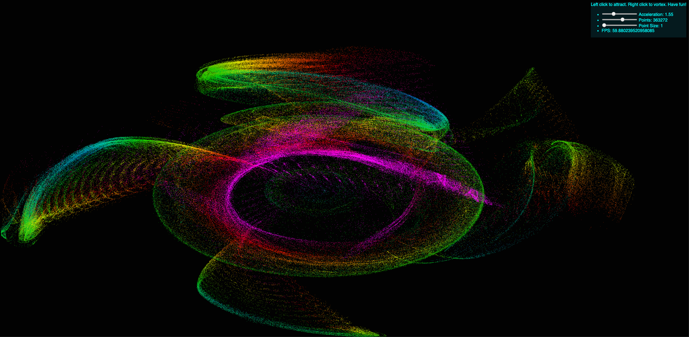

# Hack a thing 2 - WebGL particle toy improvements

## Jake Herman, Agastya Gupta, Kevin Tan

### Who did what
* Jake: Original particle engine, openGL refactoring, NPM/Gulp automation
* Kevin: Points size customization and screensaver automatic mode
* Agastya: Screensaver automatic mode and bugfixes

### Build instructions
* Install gulp `$ npm install -g gulp-cli`
* Install dependencies `npm install`
* Build: `$ gulp`

Site is output to `dist/`

### What's new
We're iterating on the design of the hack a thing 1 project by improving the build
system and using webdev tools like Gulp and NPM to handle dependencies. We're
also refactoring the codebase to be more modular (the first version is quite a
hack). This will allow us to implement more features such as a screensaver mode
that doesn't require user interaction.

### What didn't work
* We originally wanted to do a music analysis project and settled on the [Essentia](http://essentia.upf.edu/documentation/index.html)
python library. We couldn't get it to build on OSX reliably and had trouble
integrating it with Jupyter Notebook / IPython, so we shelved the project and
decided to iterate on this one instead.
* We tried to get sound input working for an audio visualizer type thing using
a JS library called p5. However, we couldn't integrate it with Typescript
effectively and had trouble getting it to load properly in the browser.

### What we learned
The JS ecosystem has _so many_ build systems/tools to choose from. We learned how
Gulp works because it seemed like the simplest one and this isn't a very complex
site. This was also a great refresher in web-dev since none of the team members
had developed a frontend in a long time.

Our failed attempt to use Essentia also showed us the importance of easy, reproducable
builds. If that library was easy to install/run then we'd probably use that for
our hack-a-thing but we couldn't get it working. By contrast, the web tools we're
using for this project all worked the first time we set them up.

### Inspiration for future projects
This project got us more interested in web development because even though the
platform has its drawbacks, the end user does not need to install anything to use
the app. It's nice to be able to deploy your app to a website and then anyone can
access it instantly without having to install or setup anything. It also got us
more interested in graphics and maybe using OpenGL for some kind of interactive
data visualization.

### Tutorials / resources used
* https://www.typescriptlang.org/docs/handbook/gulp.html
* http://lesscss.org/
* https://gulpjs.org/getting-started.html
* https://medium.com/superhighfives/deploying-to-github-pages-with-gulp-c06efc527de8

# Hack a thing 1 README for background info
### What is it
Live demos are cooler than words: check it out [here](http://cs98.me/hack-a-thing-1-particletoy/). Click and drag to interact with particles. Right click reverses the effect.

It's a particle simulator that draws particles on a canvas and lets the user interact
with them using the mouse. Click to accelerate particles toward the mouse and right click to repel them.

I implemented the system using OpenGL Transform Feedback so that all of the heavy math
is done in parallel on the GPU. This enables my 4-year-old laptop to handle over 2
million particles in realtime, which would not be anywhere near practical running on
the CPU, let alone in JS in a web browser. The basic idea is that the vertex shader
computes the position and velocity for each particle in the next frame and saves those
values to a buffer while drawing the current frame. The drawing thread then copies
that buffer back into the main particle buffer once drawing is complete. Mouse position
and state are passed into the shader with uniforms.

### Tutorials
* https://webgl2fundamentals.org/webgl/lessons/webgl-fundamentals.html
* https://www.typescriptlang.org/docs/handbook

### Why
I have played with OpenGL before and thought it'd be cool to build something with it that
can run in a website. I've also been interested in Typescript and new web technologies
since most of my experience is in backend systems, so this seemed like a cool way
to combine them. Also, it looks cool and is fun to play with.

### What I learned
* Typescript is very easy to work with and feels a lot like Python's new type
system. I could see it being very useful in a large web app with a lot of
complexity. For this simple project I probably didn't gain a ton from it, but it
gave my editor (VS code) very good autocompletion for the complex OpenGL API so
that was nice.
* WebGL 2 is very powerful, but working with raw OpenGL calls really increases
the complexity of the project. I'm just trying to draw a bunch of points on a
canvas and to do this I had to set up a vertex buffer object, manage several
vertex attribute arrays, write and compile/link shaders, and manage OpenGL's
complex state machine. The performance payoff was massive but the complexity
makes working with it very challenging. This is made worse by the fact that the
API provides very few static guarantees so it's super easy to shoot yourself in
the foot if you're unfamiliar with how OpenGL works. A strongly-typed wrapper that
encapsulates OpenGL's implicit state would make this much more pleasant to work
with.

### What didn't work
* I tried for a while to get transform feedback to work with a single buffer rather
than separate input/output buffers, but I never could get it working quite right.
* Due to simplicity / time constraints I couldn't get a nice JS UI framework to
handle the sliders / text on the page so the overall page design is pretty bad
from a web design point of view. My main interest with this exercise was the OpenGL
part though, and that was a success.
* I briefly looked at automated website packaging / deployment systems but I
couldn't get it working quickly so the process for deploying this on
github pages is to manually merge changes into the gh-pages branch and manually
re-run the typescript compiler. Again, this is sub-optimal from a webdev point
of view.
